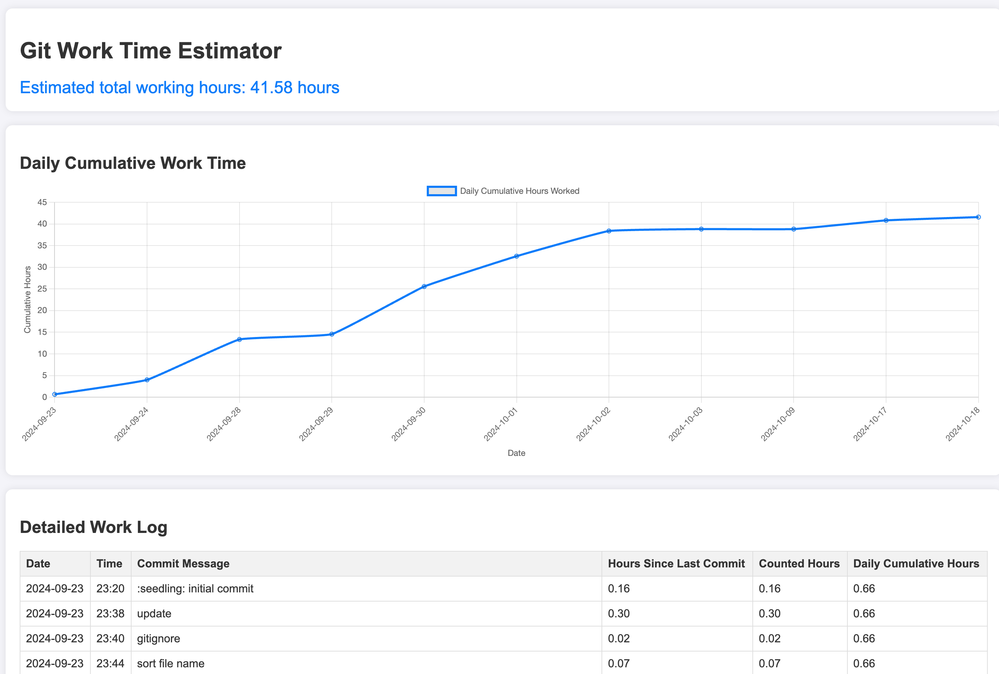

# Git Work Time Estimator



Git Work Time Estimator is a tool that analyzes the commit history of a Git repository to estimate the project's working hours.

## Features

- Analyzes Git logs to estimate working time
- Displays daily cumulative working hours in a graph
- Shows detailed work log in a table format

## How to Use

1. Clone the repository:
   ```
   git clone https://github.com/yourusername/git-work-time-estimator.git
   ```

2. Install dependencies:
   ```
   npm install
   ```

3. In the `gitLogAnalyzer.js` file, change the `repoPath` variable to the path of the Git repository you want to analyze.

4. Start the application:
   ```
   npm start
   ```

5. Open your browser and visit `http://localhost:3000` to view the results.

## Notes

- This tool provides estimated values and may differ from actual working hours.
- Commits with intervals of more than 3 hours are considered as separate work sessions.

## License

This project is released under the MIT License. See the [LICENSE](LICENSE) file for details.
